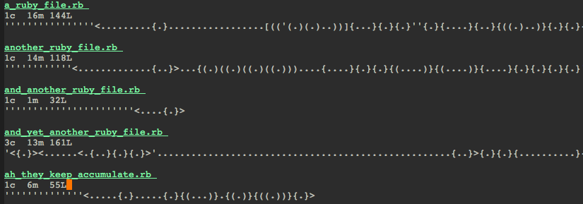

# Signature survey

Generate a signature survey for a glob pattern of your ruby project.
Only ruby supported so far and support is spotty because of ruby's
complicated syntax.

Inspired by: http://c2.com/doc/SignatureSurvey.

- <> denoted classes
- {} denotes methods
- [] denotes loops
- () denotes conditionals
- ' denotes comments
- . denotes other types of rows

This is proof of concept code to determine usefulness of approach. I
want to make it possible to navigate to the files through the
`*signature*` buffer. And add some highlighting in the report buffer.

Other languages would be nice as well. Javascript and Coffeescript
would probably be first up. If one could ride on top of semantic that
would be nice as well but I'm not familiar enough with it.

## Installation

Installation alternatives:

- Clone repository and add to `load-path`.

## Usage

Issue `M-x signature-report` and supply a glob pattern to the ruby
files to display signatures for.
